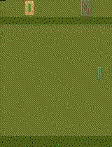

# Learning to Play Pong with a Deep Q-Network (DQN)
This project implements a Deep Q-Network (DQN) to play the game of Pong using PyTorch and OpenAI Gym. The DQN algorithm learns to play Pong by training a neural network to estimate the expected rewards (Q-values) for different actions in different states. Over time, the DQN improves its performance through a combination of exploration and exploitation.



## Overview
The DQN algorithm is a fundamental approach to reinforcement learning and has been successfully applied to various environments, including classic video games like Pong. This project provides a Python implementation of the DQN algorithm for training an agent to play Pong. More can be learned about the DQN algorithm from the following paper:

[Mnih, V., Kavukcuoglu, K., Silver, D. et al. Human-level control through deep reinforcement learning. Nature 518, 529–533 (2015). https://doi.org/10.1038/nature14236](https://doi.org/10.1038/nature14236)

## Installation
To prepare the environment for running the DQN agent, follow these steps:

1. Clone the repository to your local machine
2. Install the required dependencies using `pip install -r requirements.txt`
3. Ensure that the `models/ALE` folder exists
4. Ensure CUDA is installed and available on your machine (if you want to train on GPU)

## Running Instructions
### Training
The DQN agent can be trained on two different environments: Pong and CartPole. To train the DQN agent on Pong, run the following command:

```bash
python train.py --env ALE/Pong-v5
```
You can also specify the other optional arguments `--evaluate_freq` (evaluation frequency) and `--evaluation_episodes` (number of evaluation episodes).

After training is done, the trained model will be saved in the `models/` folder. A graph of the training and evaluation rewards will also be saved in the root folder.

### Evaluating
After the agent has been trained, you can evaluate the agent's performance by running the following command:

```bash
python evaluate.py --env ALE/Pong-v5 --path <path_to_model>
```

Optional arguments `--n_eval_episodes` (number of evaluation episodes), `--render` (render the environment), and `--save_video` (save a video of the agent playing the game) can also be specified.
